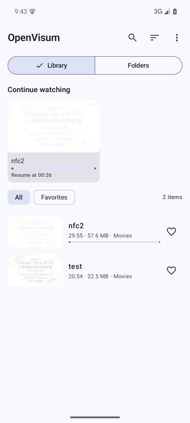
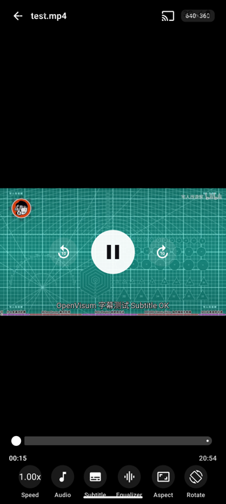
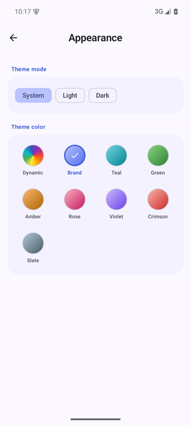
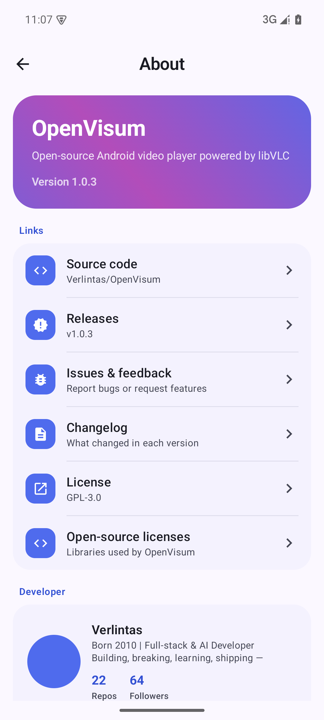

# OpenVisum

开源 Android 视频播放器，由 libVLC 驱动。几乎什么格式都能播，自动识别音轨与字幕。

An open-source Android video player powered by libVLC. Plays virtually any format, with automatic audio-track and subtitle detection.

<p align="center">
  
  
  
  
</p>

## 特性 Features

**格式与解码**
- 基于 libVLC：DivX、Xvid、RMVB、HEVC、AV1、DTS、AC3/EAC3、TrueHD、FLAC 等
- 硬件解码优先，失败自动回退软件解码
- ASS/SSA 特效字幕、SRT/VTT 等常见格式

**字幕**
- 自动识别内嵌字幕轨并按首选语言自动选中
- 自动匹配视频同目录的同名外挂字幕（媒体库 / SAF / 文件夹）
- 手动添加字幕文件、字幕延迟调节、字号/加粗/颜色自定义
- 在线搜索下载（OpenSubtitles，需自备 API key）

**音频**
- 多音轨自动识别与切换，音频延迟互对齐
- 10 段均衡器（预设 + 自定义频段、前置增益）
- 立体声模式、HDMI 源码输出（实验性）

**播放**
- 画面比例（适应/铺满/原始/16:9/4:3/21:9/2.35:1）、旋转
- 0.25x–4x 变速、A-B 循环
- 投屏到 Chromecast / DLNA 渲染设备

**媒体库与网络**
- 媒体库 + 文件夹双模式：MediaStore 扫描、SAF 添加任意文件夹
- 继续观看、收藏、搜索、排序（时间/名称/大小/时长）
- SMB（SMB2/3）与 WebDAV 网络位置，密码经 Android Keystore 加密保存
- HTTP / HTTPS / HLS (m3u8) 直链播放与历史记录

**界面**
- Material 3 + 官方色彩算法生成的 **9 种主题色**（品牌蓝/青碧/松绿/琥珀/玫瑰/紫罗兰/绯红/石墨 + 跟随系统动态取色），明暗双色板
- 大标题折叠主页、双列网格、分组式设置、播放器玻璃质感控件、全套过渡动画
- 应用内语言切换（跟随系统 / 简体中文 / 繁體中文 / English，系统级 per-app language）
- 默认倍速、记忆播放位置、默认字幕样式等完整设置项
- 无 GMS 依赖，适配各大厂商定制 Android 系统

## 系统要求 Requirements

- Android 14 (API 34) 及以上
- 架构：arm64-v8a / armeabi-v7a / x86_64

## 下载 Download

前往 [Releases](https://github.com/Verlintas/OpenVisum/releases) 下载对应架构的 APK（`arm64-v8a` 适用于绝大多数手机）。

## 构建 Build

需要 JDK 17、Android SDK Platform 37。

```bash
# Debug
./gradlew :app:assembleDebug

# Release（需配置签名，见下）
./gradlew :app:assembleRelease
```

Release 签名可通过环境变量或 `keystore.properties` 配置：

```properties
storeFile=/path/to/keystore.jks
storePassword=...
keyAlias=...
keyPassword=...
```

或环境变量 `OPENVISUM_KEYSTORE_PATH`、`OPENVISUM_KEYSTORE_PASSWORD`、`OPENVISUM_KEY_ALIAS`、`OPENVISUM_KEY_PASSWORD`。

中国大陆网络可开启镜像（阿里云）加速依赖下载，在你的 `~/.gradle/gradle.properties` 加入：

```properties
openvisum.cnMirrors=true
```

## 项目结构 Project layout

```
app/            UI、导航、播放页、设置、网络、媒体库
core/player/    PlaybackEngine 接口 + libVLC 实现、音轨/字幕/均衡器/投屏
core/data/      Room、MediaStore 扫描、SAF、SMB/WebDAV、字幕 Provider
core/common/    工具（时间/语言/字幕匹配）
```

## 已知限制 Known limitations

- 手机作为 DLNA 接收端（接收其他设备投屏）尚未实现，计划 v1.1
- HDMI 源码输出依赖设备音频通路，行为因厂商而异（实验性）
- 在线字幕下载需要 OpenSubtitles 账号（API key 免费申请）

## 许可证 License

GPL-3.0。本项目使用 [libVLC](https://www.videolan.org/vlc/libvlc.html)（LGPL-2.1-or-later），详见 [LICENSE](LICENSE)。
