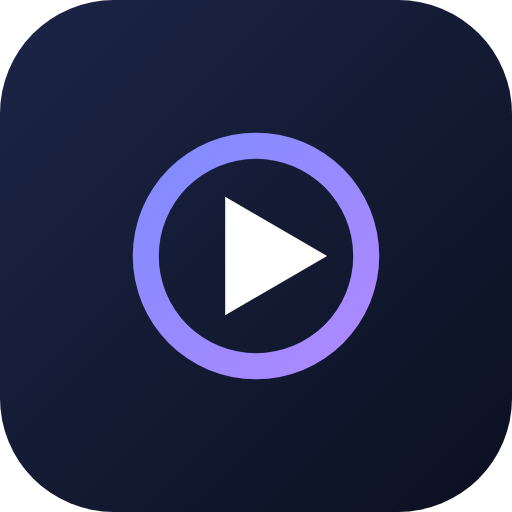
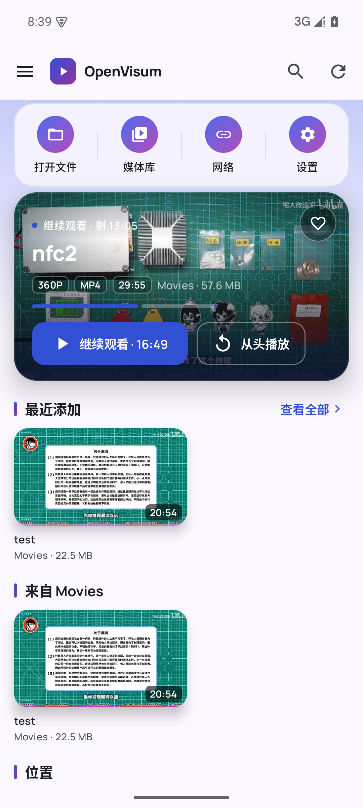
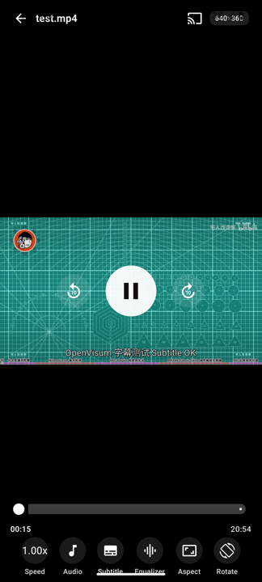
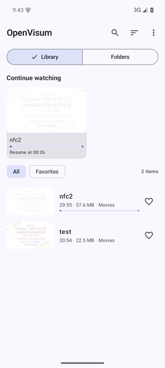
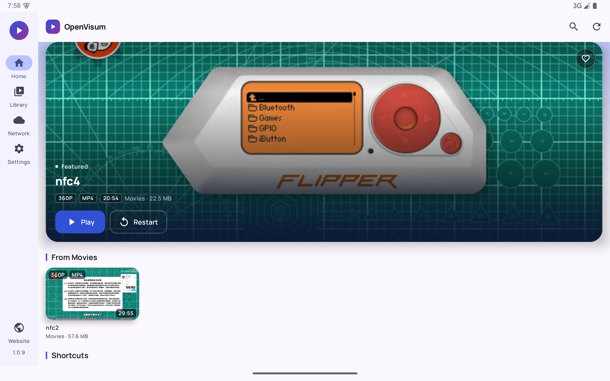

<p align="center">
  
</p>

<h1 align="center">OpenVisum</h1>

<p align="center">
  <strong>开源 Android 视频播放器 · libVLC 内核</strong><br />
  全格式解码 · 字幕全链路 · DLNA 投屏 · 9 套主题色 · 无 GMS 依赖<br />
  <sub>Open-source Android video player powered by libVLC</sub>
</p>

<p align="center">
  <a href="https://github.com/Verlintas/OpenVisum/releases"></a>
  <a href="https://github.com/Verlintas/OpenVisum/actions/workflows/build.yml"></a>
  <a href="LICENSE"></a>
  
  <a href="https://verlintas.github.io/OpenVisum/"></a>
</p>

<p align="center">
  
  
  
  
</p>

## 为什么是 OpenVisum

- **什么都能播**：libVLC 3.7 内核，DivX / HEVC / AV1 / DTS / TrueHD / FLAC……硬解优先、出错自动回退软解
- **字幕省心**：内嵌轨道按语言自动选中、同目录外挂字幕自动匹配、ASS 特效渲染、在线搜索下载
- **桌面级播放体验**：拖动进度条实时画面预览、真·裁剪填满（不拉伸）、0.25x–4x 变速、A-B 循环、全屏沉浸触控
- **局域网 & 投屏**：SMB2/3、WebDAV、HTTP/HLS 直链；DLNA 投屏由内置串流服务器直传，电视端可随意拖动进度
- **界面讲究**：Hero 工作区首页、手机常驻迷你侧栏（存储圆环）、9 套主题色明暗双色板、全套动画
- **放心使用**：GPL-3.0 开源、无广告无统计、无 GMS 依赖；凭据经 Android Keystore 加密，启动可开启隐私缓冲

## 下载 Download

| 架构 | 适用设备 | 下载 |
| --- | --- | --- |
| `arm64-v8a` | 绝大多数现代手机（推荐） | [官网镜像](https://verlintas.github.io/OpenVisum/#download) · [GitHub](https://github.com/Verlintas/OpenVisum/releases/latest) |
| `armeabi-v7a` | 老旧 32 位设备 | [官网镜像](https://verlintas.github.io/OpenVisum/#download) · [GitHub](https://github.com/Verlintas/OpenVisum/releases/latest) |
| `x86_64` | 模拟器 / x86 平板 | [官网镜像](https://verlintas.github.io/OpenVisum/#download) · [GitHub](https://github.com/Verlintas/OpenVisum/releases/latest) |

- 系统要求：**Android 14 (API 34) 及以上**
- 安装时需允许浏览器「安装未知应用」；不定架构就选 `arm64-v8a`
- 所有版本的 SHA-256 校验值见 [官网 releases.json](https://verlintas.github.io/OpenVisum/releases.json)
- 官网提供交互介绍、技术内幕与更新日志：<https://verlintas.github.io/OpenVisum/>

## 功能 Features

**格式与解码**
- libVLC 引擎：DivX、Xvid、RMVB、HEVC、AV1、DTS、AC3/EAC3、TrueHD、FLAC 等
- 硬件解码优先，失败自动回退软件解码；ASS/SSA 特效字幕与常见字幕格式

**字幕**
- 内嵌字幕轨自动识别并按首选语言选中；同目录外挂字幕自动匹配（发布标签与语言后缀智能打分）
- 手动添加、延迟调节、字号/加粗/颜色自定义；OpenSubtitles 在线搜索（需自备 API key）

**音频**
- 多音轨识别与切换、音轨延迟对齐、10 段均衡器、多种声道模式、HDMI 源码输出（实验性）

**播放**
- 拖动进度条画面预览（缩略图 + 时间码）、真裁剪填满 / 拉伸铺满 / 原始比例 / 16:9 / 4:3 / 21:9 / 2.35:1、画面旋转
- 0.25x–4x 变速、A-B 循环、±10s 快进快退；全屏沉浸播放器
- DLNA / Chromecast 投屏：本地视频经内置局域网串流服务器直传（支持远程拖动进度），网络来源直接投递原地址

**媒体库与网络**
- 媒体库 + 文件夹双模式（MediaStore 扫描 / SAF 任意文件夹）、继续观看、收藏、搜索、排序
- SMB（SMB2/3）与 WebDAV 浏览，HTTP / HLS (m3u8) 直链播放；凭据经 Android Keystore 加密

**界面**
- 手机常驻迷你侧栏（纯图标导航 + 存储占用圆环），展开为纯文字抽屉并显示存储明细
- 平板 / 折叠屏：宽屏常驻侧边栏 + 多列网格；启动隐私缓冲默认隐藏媒体内容
- Material 3 + 官方色彩算法生成的 9 套主题（含跟随系统动态取色），明暗双色板实时换肤
- 应用内语言切换（简体中文 / 繁體中文 / English / 跟随系统）

## 技术内幕 Under the hood

| 模块 | 职责 |
| --- | --- |
| `app` | Compose UI、导航、播放页、设置、网络、媒体库 |
| `core:player` | `PlaybackEngine` 抽象 + libVLC 实现、字幕/音轨、投屏与局域网串流服务器 |
| `core:data` | Room、MediaStore 扫描、SAF、SMB/WebDAV、字幕 Provider、设置存储 |
| `core:common` | 纯 Kotlin 工具：字幕匹配打分、语言归一化、时间/大小格式化 |

- 约 2 万行 Kotlin、4 个 Gradle 模块、16 个单元测试；依赖方向 `app → core:* → core:common`
- 内置 ~270 行手写 HTTP 串流服务器（Range/206 分段）解决电视无法访问 `content://` 的问题
- 真裁剪通过 TextureView + `graphicsLayer` 等比放大实现，不依赖 Android vout 上不可用的视频滤镜
- 设计细节见 [docs/ARCHITECTURE.md](docs/ARCHITECTURE.md)，厂商兼容见 [docs/OEM_COMPAT.md](docs/OEM_COMPAT.md)

## 构建 Build

需要 JDK 17 与 Android SDK Platform 37。

```bash
# 调试构建
./gradlew :app:assembleDebug

# 单元测试
./gradlew test
```

Release 签名通过环境变量或 `keystore.properties` 配置：

```properties
storeFile=/path/to/keystore.jks
storePassword=...
keyAlias=...
keyPassword=...
```

也支持环境变量 `OPENVISUM_KEYSTORE_PATH`、`OPENVISUM_KEYSTORE_PASSWORD`、`OPENVISUM_KEY_ALIAS`、`OPENVISUM_KEY_PASSWORD`。

中国大陆网络可在 `~/.gradle/gradle.properties` 加入 `openvisum.cnMirrors=true` 启用阿里云镜像加速依赖下载。

## 项目结构 Project layout

```
app/            Compose UI、导航、播放页、设置、网络、媒体库
core/player/    PlaybackEngine 接口 + libVLC 实现、投屏、MediaStreamServer
core/data/      Room、MediaStore 扫描、SAF、SMB/WebDAV、字幕 Provider
core/common/    纯 Kotlin 工具（字幕匹配 / 语言 / 时间）
site/           官网静态页（GitHub Pages）
tools/          主题色生成器、版权头检查等
docs/           架构与兼容文档、截图
```

## 已知限制 Known limitations

- 手机作为 DLNA 接收端（接收其他设备投屏）尚未实现，计划 v1.1
- DLNA 投屏兼容性因电视/接收端实现而异；路由器开启 AP 隔离或使用访客网络时无法发现设备
- HDMI 源码输出依赖设备音频通路，行为因厂商而异（实验性）
- 在线字幕下载需要 OpenSubtitles 账号（API key 免费申请）

## 参与贡献 Contributing

欢迎 Issue 与 PR！提交前请阅读 [CONTRIBUTING.md](CONTRIBUTING.md)，Bug 请使用仓库内置的 Issue 表单（附机型、系统版本与复现步骤），安全问题请按 [SECURITY.md](SECURITY.md) 私下报告。

## 更新日志 Changelog

见 [CHANGELOG.md](CHANGELOG.md)，官网同步展示最新版本更新内容。

## 许可证 License

[GPL-3.0-or-later](LICENSE)。本项目使用 [libVLC](https://www.videolan.org/vlc/libvlc.html)（LGPL-2.1-or-later），感谢 VideoLAN 社区。
